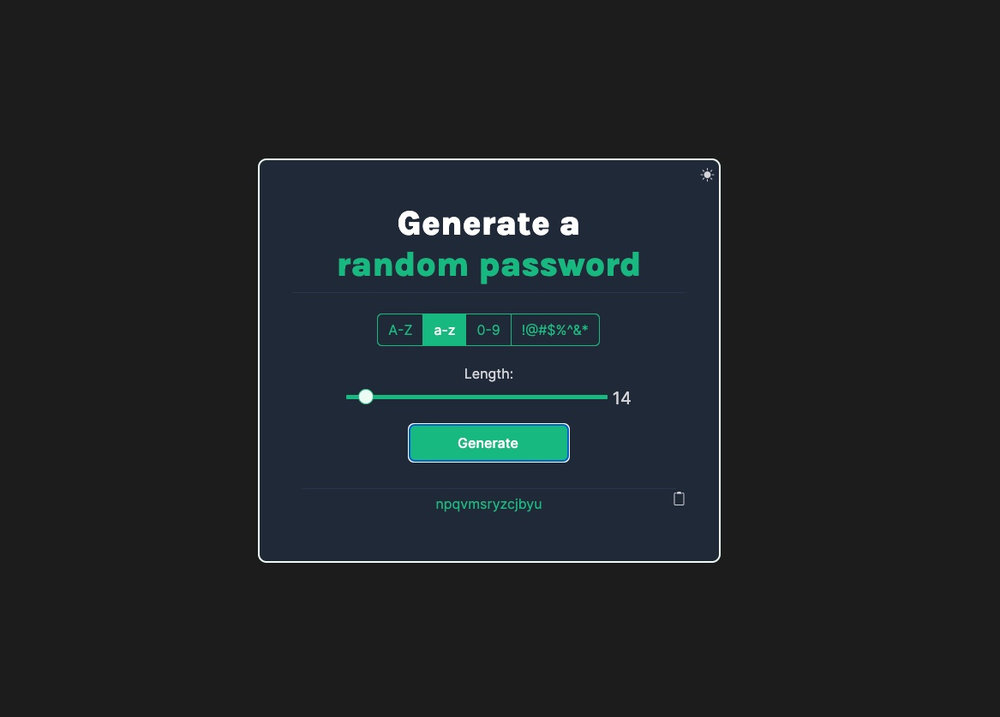

# Password Generator

This is my stab at the Password Generator solo project from [scrimba.com's learnjavascript](https://scrimba.com/learn/learnjavascript) course.


## Screenshots




## Run Locally

Clone the project

```bash
  git clone https://github.com/battim/password-generator.git
```

Go to the project directory

```bash
  cd my-project
```

Install dependencies

```bash
  npm install
```

Start the server

```bash
  npm run start
```


## Authors

- [@battim](https://www.github.com/battim)

